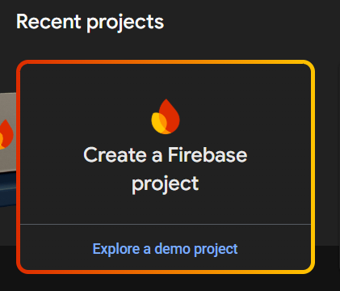
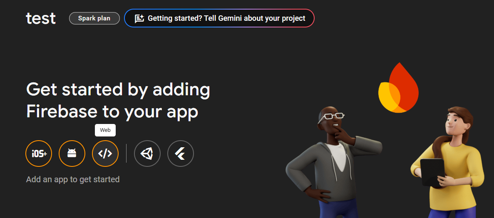
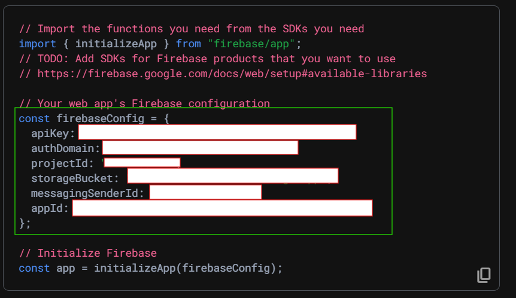
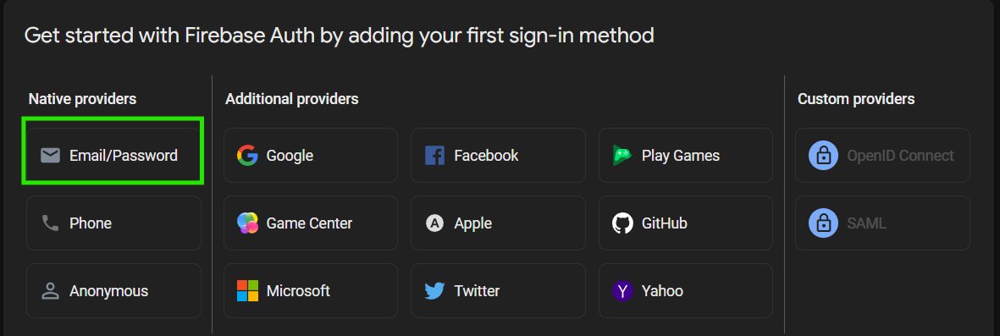

# React-Ignite

### Installation
``` bash
npx react-ignite@latest
```

### Setup Guide for react-tailwind-shadcn-firebase template

1) Create a file named **.env** in your source directory

2) Copy contents of **.env.example** into **.env**

3) Create a new firebase project in firebase console
    

4) Enter you project name and click on continue and wait for some time till your project is created. 

5) Register you project as a web app
    

6) Register your app and then copy the firebase SDK keys
    

4) Click on Authentication -> Get Started -> Select Email/Password provider
    

5) Create a new firestore database, Click on Cloud Firestore -> Create database.

6) All set ! Your template is ready. 
